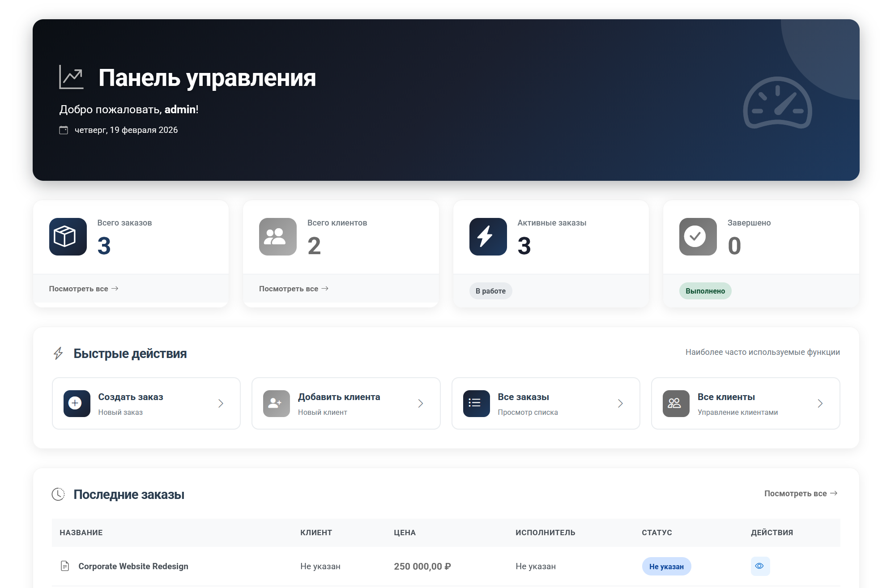
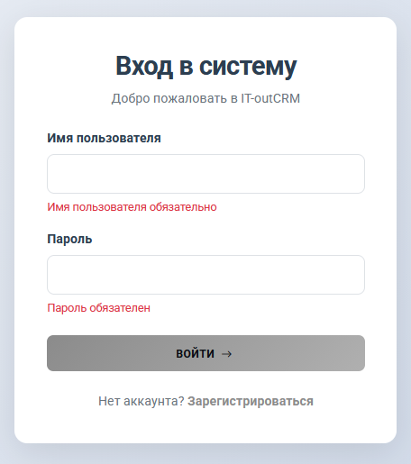
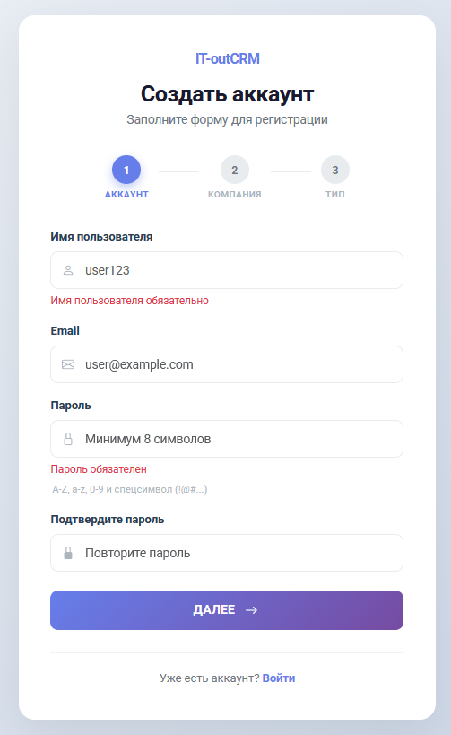
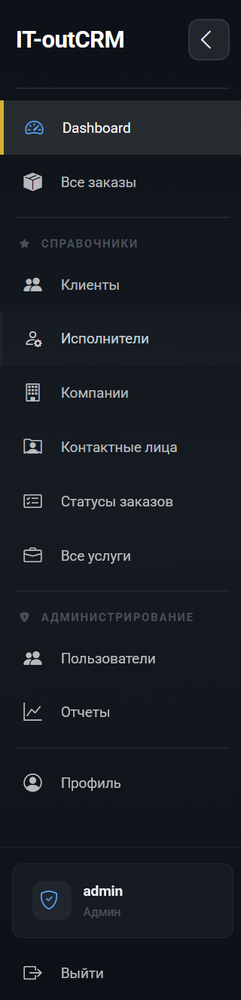
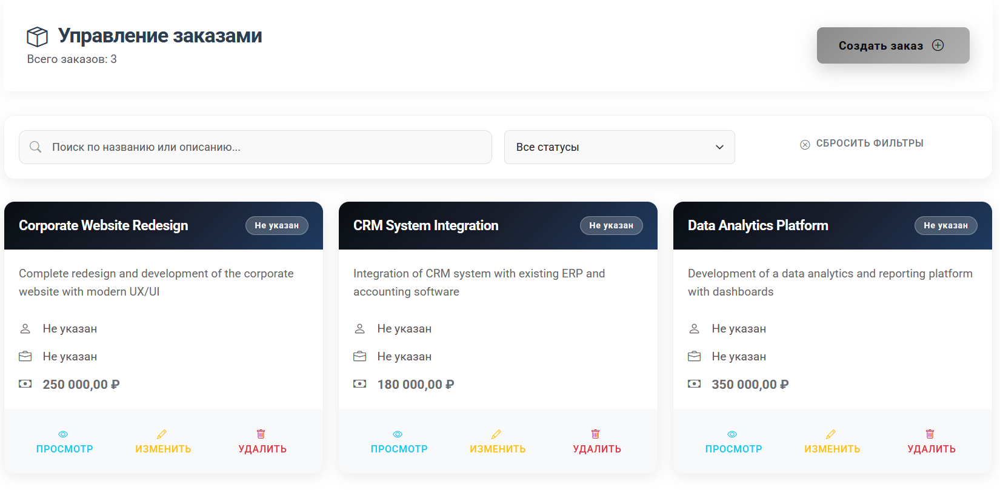
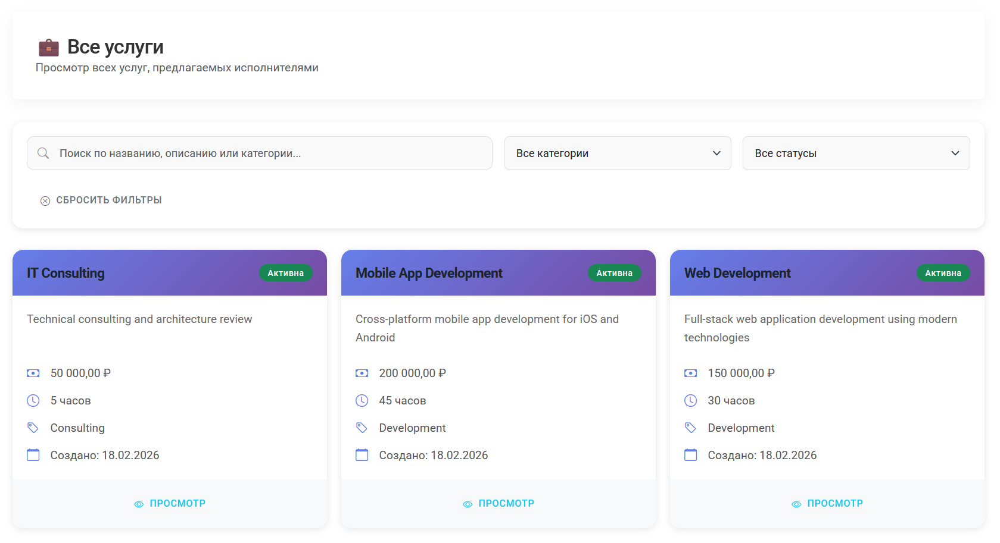
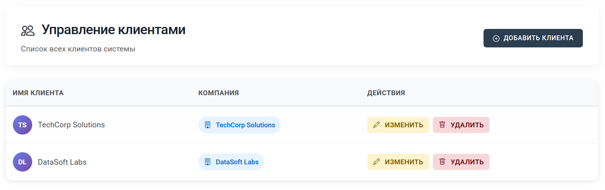
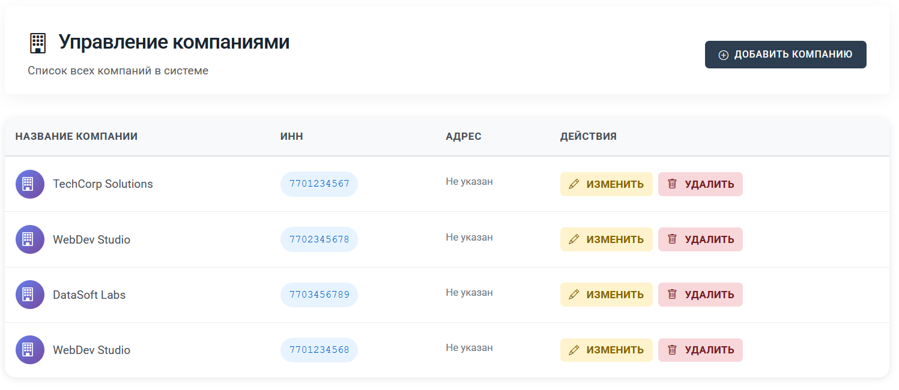
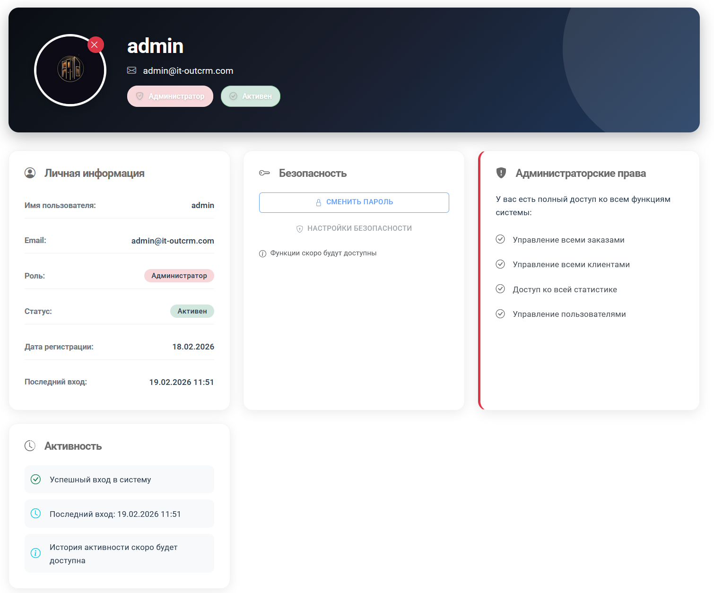
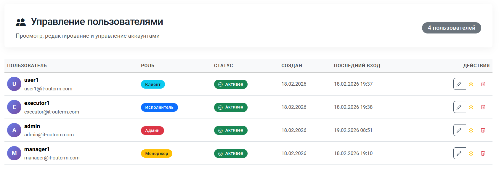

# IT-outCRM

CRM-система для IT-аутсорсинговых компаний. Управление заказами, клиентами, исполнителями и услугами через веб-интерфейс на Blazor + REST API на ASP.NET Core.



## Стек

- **Backend:** .NET 10, ASP.NET Core Web API, C#
- **Frontend:** Blazor Server
- **БД:** PostgreSQL 17, Entity Framework Core
- **Аутентификация:** JWT + ролевая модель (Admin, Manager, Executor, User)
- **Валидация:** FluentValidation
- **Маппинг:** AutoMapper
- **Контейнеризация:** Docker Compose (PostgreSQL + pgAdmin)

## Интерфейс

### Авторизация и регистрация

Вход в систему и пошаговая регистрация с выбором типа аккаунта (заказчик / исполнитель).

<p align="center">
  
  &nbsp;&nbsp;&nbsp;
  
</p>

### Навигация

Боковое меню с разделами в зависимости от роли. Администратору доступны «Пользователи» и «Отчёты», клиенту — только его заказы.

<p align="center">
  
</p>

### Заказы

Карточки заказов с фильтрацией по статусу и поиском. Каждый заказ можно просмотреть, отредактировать или удалить.



### Услуги

Каталог услуг исполнителей — стоимость, категория, время выполнения.



### Клиенты и компании

Управление базой клиентов и привязанных к ним юридических лиц (ИНН, контактные данные).





### Профиль пользователя

Личная информация, роль, дата регистрации, последний вход.



### Администрирование пользователей

Таблица всех аккаунтов с возможностью редактирования, заморозки и удаления. Видна только администратору.



## Быстрый старт

### Что нужно

- [.NET 10 SDK](https://dotnet.microsoft.com/download)
- [Docker Desktop](https://www.docker.com/products/docker-desktop) (для PostgreSQL) или локальный PostgreSQL 17

### 1. Клонировать репозиторий

```bash
git clone https://github.com/yourusername/IT-outCRM.git
cd IT-outCRM
```

### 2. Поднять базу данных

```bash
cd IT-outCRM.Infrastructure
docker-compose up -d
```

Запустятся PostgreSQL (порт `5432`) и pgAdmin (порт `8080`).

### 3. Настроить секреты

```bash
cd ../IT-outCRM
dotnet user-secrets init
dotnet user-secrets set "ConnectionStrings:DefaultConnection" "Host=localhost;Port=5432;Database=it_outcrm;Username=postgres;Password=yourpassword"
dotnet user-secrets set "Jwt:Key" "YourSecretKeyAtLeast64CharactersLong_ChangeThis!"
```

### 4. Применить миграции

```bash
dotnet ef database update --project ../IT-outCRM.Infrastructure --startup-project .
```

### 5. Запустить

В двух терминалах:

```bash
# API (порт 5295)
cd IT-outCRM
dotnet run

# Blazor (порт 5159)
cd IT-outCRM.Blazor
dotnet run
```

Открыть `http://localhost:5159` в браузере.

## Структура проекта

```
IT-outCRM/
├── IT-outCRM/                 # Web API — контроллеры, middleware, точка входа
├── IT-outCRM.Application/     # Бизнес-логика — сервисы, DTO, валидаторы, интерфейсы
├── IT-outCRM.Blazor/          # Веб-интерфейс — Blazor Server, компоненты, страницы
├── IT-outCRM.Domain/          # Доменные сущности
├── IT-outCRM.Infrastructure/  # Доступ к данным — EF Core, репозитории, миграции, Docker
└── IT-outCRM.Tests/           # Unit-тесты
```

Архитектура — Clean Architecture. Domain не зависит ни от чего, Application зависит от Domain, Infrastructure реализует интерфейсы Application.

## API

Swagger UI доступен после запуска API-проекта: `http://localhost:5295/swagger`

Основные группы эндпоинтов:

| Раздел | Путь | Описание |
|---|---|---|
| Auth | `/api/auth/*` | Регистрация, вход, профиль, управление пользователями |
| Orders | `/api/orders/*` | CRUD заказов, фильтрация по статусу/клиенту/исполнителю |
| Customers | `/api/customers/*` | Управление клиентами |
| Companies | `/api/companies/*` | Управление компаниями, поиск по ИНН |
| Executors | `/api/executors/*` | Управление исполнителями |
| Contact Persons | `/api/contactpersons/*` | Контактные лица |
| Order Statuses | `/api/orderstatuses/*` | Справочник статусов заказов |
| Account Statuses | `/api/accountstatuses/*` | Справочник статусов аккаунтов |

Все эндпоинты (кроме auth) требуют JWT-токен. Доступ разграничен по ролям.

## Роли

| Роль | Возможности |
|---|---|
| **Admin** | Полный доступ: пользователи, заказы, справочники, удаление |
| **Manager** | Создание и редактирование заказов, клиентов, исполнителей |
| **Executor** | Просмотр доступных заказов, управление своими услугами |
| **User** | Создание заказов, просмотр своих заказов |

## Лицензия

MIT
